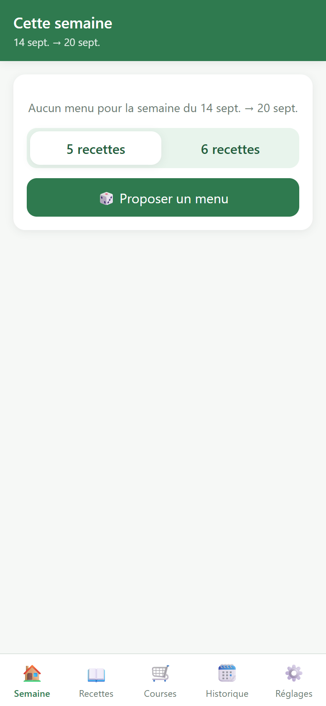
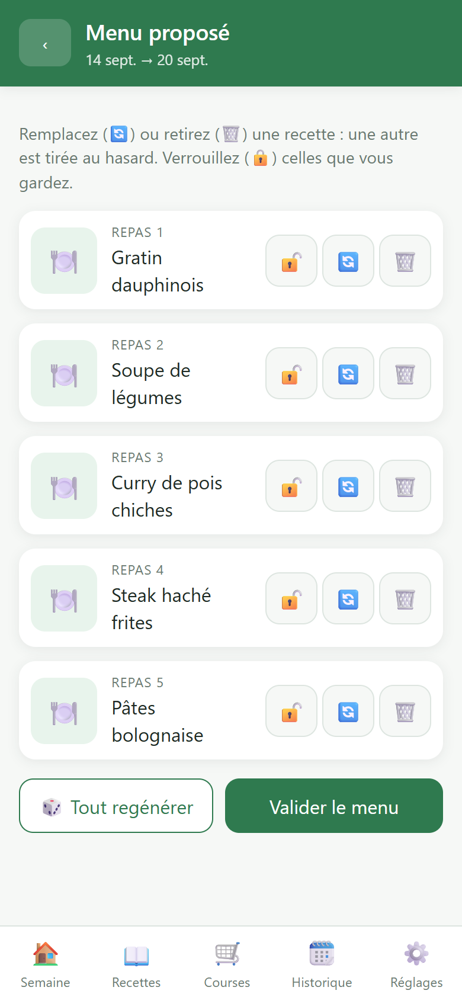
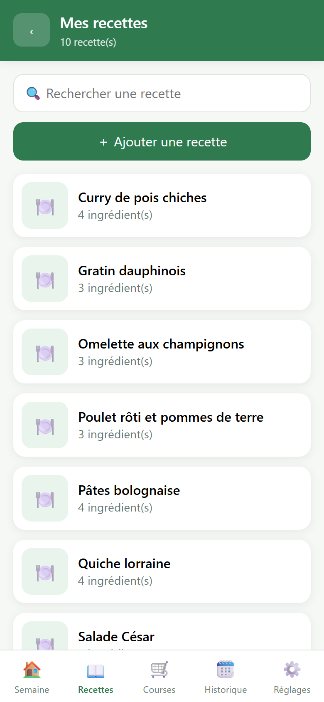
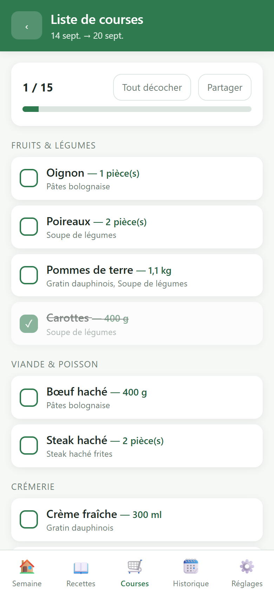

# Food

Application web (mobile-first) de menus hebdomadaires et de liste de courses
pour un foyer de deux personnes.

- Catalogue de recettes (nom, photo optionnelle, ingrédients)
- Génération d'un menu de 5 ou 6 recettes sans doublon
- Remplacement / retrait d'une recette avec nouveau tirage au hasard
- Liste de courses agrégée par rayon à partir du menu validé
- Export JSON des recettes et du référentiel d'ingrédients
- Un compte unique partagé par les deux utilisateurs

Les spécifications fonctionnelles sont dans [SPECS.md](SPECS.md).

## Aperçu

| Proposer un menu | Ajuster les recettes |
|:---:|:---:|
|  |  |

| Catalogue de recettes | Liste de courses |
|:---:|:---:|
|  |  |

## Pile technique

| Élément  | Choix                                          |
|----------|------------------------------------------------|
| Backend  | PHP 8.1+ (sans framework ni Composer)          |
| Base     | SQLite (PDO)                                   |
| Frontend | SPA vanilla JS + CSS, sans dépendance          |
| Sessions | Sessions PHP natives, cookie `HttpOnly`        |

Extensions PHP requises : `pdo_sqlite`, `mbstring`, `fileinfo`, et `gd`
(redimensionnement des photos de recettes).

## Installation et lancement

```bash
git clone <ce dépôt> && cd food
php -S localhost:8000 -t public public/index.php
```

La base SQLite et son schéma sont créés automatiquement au premier appel
(`database/food.sqlite`). Ouvrez ensuite <http://localhost:8000> : au tout
premier accès, l'application demande de choisir le mot de passe du compte
partagé (identifiant `morand` par défaut, modifiable à ce moment-là). Ce mot de
passe n'est écrit nulle part dans le dépôt ; il peut être changé ensuite depuis
l'écran **Réglages**.

### Jeu de démonstration

```bash
php bin/seed.php "votre-mot-de-passe" [identifiant]
```

Crée le compte s'il n'existe pas encore et ajoute 10 recettes.

### Export des données

L'écran **Réglages** propose « Exporter en JSON » : le fichier téléchargé
(`food-export-AAAA-MM-JJ.json`) contient le référentiel d'ingrédients et toutes
les recettes avec leurs ingrédients, quantités et unités. Le même contenu est
accessible via `GET /api/export` (session requise).

L'identifiant du compte peut aussi être modifié depuis cet écran.

### Variables d'environnement

| Variable           | Défaut                | Rôle                          |
|--------------------|-----------------------|-------------------------------|
| `FOOD_DB_PATH`     | `database/food.sqlite`| Chemin du fichier SQLite      |
| `FOOD_UPLOAD_DIR`  | `public/uploads`      | Dossier des photos de recettes|

## Tests

```bash
php tests/run.php    # 25 tests métier / 63 assertions (base temporaire)
php tests/http.php   # 26 vérifications end-to-end (serveur requis)
```

`tests/http.php` attend un serveur sur `http://127.0.0.1:8321` :

```bash
php -S 127.0.0.1:8321 -t public public/index.php
```

> Le serveur de développement PHP sous Windows réinitialise parfois une
> connexion sur plusieurs dizaines ; la suite HTTP rejoue donc les requêtes
> échouées au niveau transport. Ce comportement n'existe pas derrière
> Apache/Nginx.

## Déploiement

L'application fonctionne dans deux configurations.

### 1. La racine du site pointe sur `public/` (recommandé)

Tout ce qui n'est pas un fichier existant est routé vers `public/index.php`
(configuration Apache fournie dans `public/.htaccess`).

Exemple Nginx :

```nginx
root /var/www/food/public;
index index.php;
location / { try_files $uri /index.php$is_args$args; }
location ~ \.php$ { fastcgi_pass unix:/run/php/php-fpm.sock; include fastcgi_params;
                    fastcgi_param SCRIPT_FILENAME $document_root/index.php; }
```

### 2. Hébergement mutualisé, dans un sous-dossier

Si vous ne pouvez pas déplacer la racine du site — par exemple un dossier
`www/food` servi sous `https://exemple.fr/food` — téléversez le dépôt tel quel :
l'`index.php` et le `.htaccess` présents à la racine du dépôt prennent le
relais, servent `public/` et bloquent l'accès au code et à la base.

Le préfixe d'URL est détecté automatiquement (`SCRIPT_NAME`) : la page injecte
une balise `<base>`, et les appels d'API comme les photos restent relatifs. Le
cookie de session est limité au sous-dossier.

> Si votre hébergeur ignore les fichiers `.htaccess`, placez impérativement la
> base hors du dossier web avec `FOOD_DB_PATH`, sinon elle serait
> téléchargeable.

Le dossier `database/` doit être accessible en écriture par PHP, ainsi que
`public/uploads/`. Servez l'application en HTTPS : le cookie de session est
alors émis avec l'attribut `Secure`.

### Publication automatique par FTP

Le workflow [`.github/workflows/deploy.yml`](.github/workflows/deploy.yml)
exécute les deux suites de tests puis téléverse le dépôt sur un serveur FTP à
chaque push sur `main` (ou manuellement via « Run workflow »).

Secrets à définir dans *Settings → Secrets and variables → Actions* :

| Secret         | Rôle                          |
|----------------|-------------------------------|
| `FTP_SERVER`   | Hôte, par ex. `ftp.exemple.fr`|
| `FTP_USERNAME` | Identifiant FTP               |
| `FTP_PASSWORD` | Mot de passe FTP              |

Variables optionnelles (onglet *Variables*) :

| Variable          | Défaut | Rôle                                            |
|-------------------|--------|-------------------------------------------------|
| `FTP_PROTOCOL`    | `ftps` | `ftp`, `ftps` ou `ftps-legacy`                   |
| `FTP_PORT`        | `21`   | Port du serveur                                  |
| `FTP_SERVER_DIR`  | `./`   | Dossier cible, **avec barre oblique finale**     |

Le transfert est incrémental : seuls les fichiers modifiés sont envoyés. La
base SQLite et les photos envoyées par l'application ne sont ni transférées ni
supprimées, tout comme les tests et la documentation.

Si l'hébergeur n'autorise pas de pointer le domaine sur `public/`, renseignez
`FTP_SERVER_DIR` avec le dossier cible (par exemple `./food/`) : la racine du
dépôt contient déjà l'`index.php` et le `.htaccess` nécessaires.

## Organisation du code

```
bootstrap.php          autoloader, constantes, fuseau horaire
index.php, .htaccess   entrée de secours pour un hébergement en sous-dossier
bin/seed.php           compte + jeu de recettes de démarrage
database/schema.sql    schéma SQLite
docs/screenshots/      captures utilisées par le README
public/                racine web : front controller, SPA, uploads
src/Database.php       connexion PDO + migrations
src/Auth.php           compte unique, session, mot de passe
src/Http/              requête, réponse, routeur, exceptions
src/Domain/            unités, générateur de menu, agrégation des courses
src/Repository/        accès aux données (recettes, menus, listes)
src/Controller/        endpoints REST
src/routes.php         table de routage
tests/                 suites métier et HTTP
```
