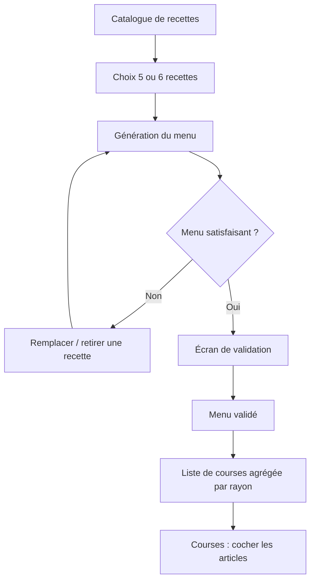

# Food — Spécifications fonctionnelles

## 1. Objectif

Food est une application web responsive (utilisable principalement depuis un
téléphone) permettant à un couple de :

1. constituer et maintenir un **catalogue de recettes** avec leurs ingrédients ;
2. générer automatiquement un **menu de la semaine** (5 ou 6 recettes) ;
3. ajuster ce menu (remplacement d'une recette par tirage aléatoire) puis le **valider** ;
4. obtenir la **liste de courses** consolidée correspondant au menu validé.

Le déroulé de la recette (étapes de préparation) est hors périmètre : seuls le
nom, une photo optionnelle et la liste d'ingrédients sont gérés.

## 2. Utilisateurs et partage

- L'application est utilisée par **un seul compte partagé** par les deux
  personnes du foyer : un identifiant (`morand` par défaut) et un mot de passe.
- Le mot de passe est choisi au premier accès, sur un écran de première
  utilisation, puis modifiable dans les Réglages. Aucun mot de passe n'est
  stocké dans le code source.
- Il n'y a ni inscription publique, ni e-mail, ni lien d'invitation : une fois
  le compte créé, seule la connexion est possible.
- **Protection contre la force brute** : au-delà de 5 tentatives de connexion
  échouées, les essais suivants sont refusés pendant 1 heure (compteur tenu par
  identifiant et adresse IP, remis à zéro par une connexion réussie). Le nombre
  d'essais restants est indiqué à l'utilisateur.
- Toutes les données (recettes, menus, listes de courses) appartiennent à ce
  compte et sont donc communes.
- Les modifications sont partagées : si l'un coche un ingrédient dans la liste de
  courses, l'autre voit la mise à jour (au plus tard au rafraîchissement de
  l'écran).

## 3. Périmètre

### Inclus (v1)

- CRUD recettes + ingrédients.
- Catalogue d'ingrédients réutilisables avec unité et rayon.
- Génération d'un menu hebdomadaire de 5 ou 6 recettes, sans doublon.
- Remplacement aléatoire d'une recette du menu proposé.
- Validation du menu.
- Liste de courses agrégée, cochable, avec ajout d'articles libres.
- Historique des menus validés.

### Exclu (v1)

- Étapes de préparation, temps de cuisson, valeurs nutritionnelles.
- Gestion des quantités par nombre de convives variable (voir §11 évolutions).
- Gestion des stocks / placard.
- Import automatique de recettes depuis le web.
- Notifications push, mode hors-ligne complet.

## 4. Modèle de données

### Ingredient (référentiel)

| Champ | Type | Règles |
|---|---|---|
| `id` | UUID | |
| `householdId` | UUID | |
| `name` | texte | obligatoire, unique par foyer (insensible à la casse/accents) |
| `defaultUnit` | enum | `g`, `kg`, `ml`, `l`, `piece`, `cuillere_a_soupe`, `cuillere_a_cafe`, `pincee`, `sachet`, `boite` |
| `category` | enum | rayon : `fruits_legumes`, `viande_poisson`, `cremerie`, `epicerie`, `surgele`, `boulangerie`, `boisson`, `entretien`, `autre` |

### Recipe

| Champ | Type | Règles |
|---|---|---|
| `id` | UUID | |
| `householdId` | UUID | |
| `name` | texte | obligatoire, 1–120 caractères, unique par foyer |
| `photoUrl` | texte | optionnel |
| `tags` | liste de textes | optionnel (ex. `rapide`, `végétarien`) |
| `isActive` | booléen | par défaut `true` ; une recette inactive n'est jamais tirée au sort |
| `createdAt` / `updatedAt` | date | |

### RecipeIngredient

| Champ | Type | Règles |
|---|---|---|
| `recipeId` | UUID | |
| `ingredientId` | UUID | |
| `quantity` | décimal | optionnel (ex. « sel » sans quantité) ; > 0 si renseigné |
| `unit` | enum | obligatoire si `quantity` renseignée |

Contrainte : un ingrédient ne peut apparaître qu'une fois dans une recette.

### WeeklyMenu

| Champ | Type | Règles |
|---|---|---|
| `id` | UUID | |
| `householdId` | UUID | |
| `weekStart` | date | lundi de la semaine concernée |
| `size` | entier | 5 ou 6 |
| `status` | enum | `draft`, `validated`, `archived` |
| `recipeIds` | liste de UUID | taille = `size`, **sans doublon** |
| `validatedAt` | date | renseigné au passage en `validated` |

### ShoppingList

| Champ | Type | Règles |
|---|---|---|
| `id` | UUID | |
| `menuId` | UUID | 1 liste par menu validé |
| `items` | liste de `ShoppingItem` | |

### ShoppingItem

| Champ | Type | Règles |
|---|---|---|
| `ingredientId` | UUID | `null` pour un article ajouté manuellement |
| `label` | texte | nom affiché |
| `quantities` | liste de `{ quantity, unit }` | agrégées par unité |
| `category` | enum | rayon pour le regroupement |
| `checked` | booléen | coché = déjà dans le caddie |
| `isManual` | booléen | article ajouté hors recettes |
| `sourceRecipes` | liste de noms | recettes à l'origine de la ligne |

## 5. Écrans

### 5.1 Accueil

- Menu de la semaine en cours (ou bouton « Générer le menu de la semaine »).
- Accès rapide : Recettes, Liste de courses, Historique.

### 5.2 Liste des recettes

- Liste alphabétique avec vignette photo (ou placeholder) et nombre d'ingrédients.
- Recherche par nom, filtre par tag, filtre actif/inactif.
- Bouton « Ajouter une recette ».

### 5.3 Fiche recette (création / édition)

- Champ **Nom** (obligatoire).
- **Photo** optionnelle : prise de photo ou upload, recadrage simple, suppression possible.
- **Ingrédients** : ajout ligne par ligne — champ de saisie avec autocomplétion
  sur le référentiel ; si l'ingrédient n'existe pas, il est créé à la volée
  (l'utilisateur choisit alors l'unité par défaut et le rayon).
- Quantité + unité facultatives par ligne.
- Actions : Enregistrer, Supprimer, Désactiver/Réactiver.
- Suppression : confirmation ; la recette est retirée des menus `draft`
  (remplacée par un tirage) mais conservée dans les menus validés/archivés
  (copie du nom historisée).

### 5.4 Génération du menu

- Choix du nombre de recettes : **5** ou **6** (défaut : dernier choix utilisé).
- Bouton « Proposer un menu ».
- Résultat : liste de cartes recette (photo + nom).
- Par carte : bouton **Remplacer** (🔄) et bouton **Retirer**.
  - « Remplacer » tire une nouvelle recette au hasard parmi les recettes actives
    **non présentes** dans le menu courant.
  - S'il n'existe aucune recette de remplacement disponible, un message l'indique
    et la carte reste inchangée.
  - « Retirer » supprime la recette de la carte et la remplace immédiatement par
    un nouveau tirage au hasard parmi les recettes actives absentes du menu ;
    si le catalogue est épuisé, la carte disparaît et le menu compte une recette
    de moins.
- Bouton « Verrouiller » (🔒) par carte : une recette verrouillée n'est pas
  modifiée par un « Tout regénérer ».
- Bouton « Tout regénérer » : retire un nouveau tirage complet sauf cartes verrouillées.
- Possibilité d'ajouter manuellement une recette choisie dans le catalogue
  (recherche), en remplacement d'une carte.
- Bouton **Valider le menu** → écran de validation.

### 5.5 Écran de validation

- Récapitulatif des 5/6 recettes retenues.
- Aperçu de la liste de courses qui sera générée (groupée par rayon).
- Boutons : « Retour » (revenir à l'ajustement) et « Valider ».
- À la validation : le menu passe en `validated`, la liste de courses est générée
  et l'utilisateur est redirigé vers l'écran Liste de courses.

### 5.6 Liste de courses

- Articles groupés par **rayon**, triés alphabétiquement dans chaque rayon.
- Chaque ligne : case à cocher, libellé, quantité(s) agrégée(s), et au tap
  l'indication des recettes d'origine.
- Les articles cochés passent en bas de leur rayon, grisés et barrés.
- Ajout d'un article libre (« sacs poubelle », « pain »…) avec rayon optionnel.
- Actions : « Tout décocher », « Partager » (export texte / copie dans le presse-papiers).
- La liste reste consultable tant que le menu n'est pas archivé.

### 5.7 Historique

- Liste des menus validés par semaine, du plus récent au plus ancien.
- Consultation du menu et de sa liste de courses.
- Action « Rejouer ce menu » : crée un nouveau menu `draft` avec les mêmes recettes.

### 5.8 Réglages

- Changement du mot de passe et de l'identifiant du compte partagé.
- Gestion du référentiel d'ingrédients (rayon, suppression).
- **Export JSON** : télécharge un fichier contenant le référentiel
  d'ingrédients et toutes les recettes avec leurs ingrédients, quantités et
  unités (`GET /api/export`). Sert de sauvegarde et de reprise de données.

## 6. Règles de génération du menu

1. Le tirage se fait parmi les recettes **actives** du foyer.
2. **Unicité stricte** : une recette ne peut apparaître qu'une seule fois dans un
   même menu hebdomadaire.
3. Si le nombre de recettes actives est inférieur à la taille demandée, le menu
   est généré avec le maximum possible et un message explique qu'il faut ajouter
   des recettes.
4. **Anti-répétition** (pondération) : les recettes utilisées dans les 2 dernières
   semaines validées sont dépriorisées ; elles ne sont tirées que si le vivier de
   recettes non récemment utilisées est insuffisant.
5. Le tirage est uniforme parmi les recettes éligibles restantes.
6. Un seul menu `draft` peut exister par semaine ; générer à nouveau écrase le
   brouillon (avec confirmation).

## 7. Règles d'agrégation de la liste de courses

1. On parcourt tous les `RecipeIngredient` des recettes du menu validé.
2. Les lignes sont regroupées par `ingredientId`.
3. Les quantités sont additionnées **par unité compatible** :
   - `g` + `kg` → converties en la plus lisible (ex. 1200 g → 1,2 kg) ;
   - `ml` + `l` → idem ;
   - les unités non convertibles entre elles (ex. `piece` et `g`) restent
     affichées séparément : « Tomates : 500 g + 2 pièces ».
4. Un ingrédient sans quantité est affiché sans quantité (ex. « Sel »).
5. La liste est figée à la validation, mais reste **modifiable manuellement**
   (cocher, ajouter, supprimer une ligne). Modifier une recette après validation
   ne change pas la liste déjà générée.

## 8. Règles de gestion transverses

- Normalisation des noms d'ingrédients : minuscules, accents et pluriels
  rapprochés pour la détection de doublons à la saisie (proposition de fusion).
- Suppression d'un ingrédient du référentiel : interdite s'il est utilisé par au
  moins une recette (proposer un renommage/fusion à la place).
- Toutes les dates sont gérées en fuseau Europe/Paris ; la semaine commence le lundi.
- Photos : formats JPEG/PNG/WebP, redimensionnées côté serveur (max 1600 px,
  ~500 Ko), stockage objet.

## 9. Exigences non fonctionnelles

- **Responsive mobile-first**, utilisable d'une main en supermarché.
- Temps de chargement des écrans principaux < 1,5 s sur 4G.
- Liste de courses consultable **hors-ligne** en lecture (cache) ; les cochages
  effectués hors-ligne sont synchronisés au retour du réseau.
- Accessibilité : contrastes AA, cibles tactiles ≥ 44 px.
- Données privées au foyer ; aucun partage public.
- Sauvegarde quotidienne de la base.

## 10. Parcours nominal

## 11. Évolutions envisagées (hors v1)

- Quantités ajustées au nombre de convives.
- Affectation des recettes à des jours précis de la semaine.
- Étapes de préparation et temps de cuisson.
- Suggestions d'équilibre (viande / poisson / végétarien) sur la semaine.
- Export de la liste vers une appli de courses tierce ou un drive.
- Mode hors-ligne complet avec synchronisation bidirectionnelle.

## 12. Critères d'acceptation (v1)

1. Je peux créer une recette avec un nom, une photo optionnelle et N ingrédients.
2. Un clic sur « Proposer un menu » génère 5 ou 6 recettes distinctes.
3. Le retrait d'une recette du menu proposé la remplace par une autre recette
   active non déjà présente dans le menu.
4. Aucun menu généré ne contient deux fois la même recette.
5. La validation d'un menu produit une liste de courses regroupant les
   ingrédients de toutes ses recettes, avec quantités additionnées par unité.
6. La liste de courses est accessible depuis l'accueil après validation, et les
   deux utilisateurs du compte partagé y accèdent avec les mêmes données.
